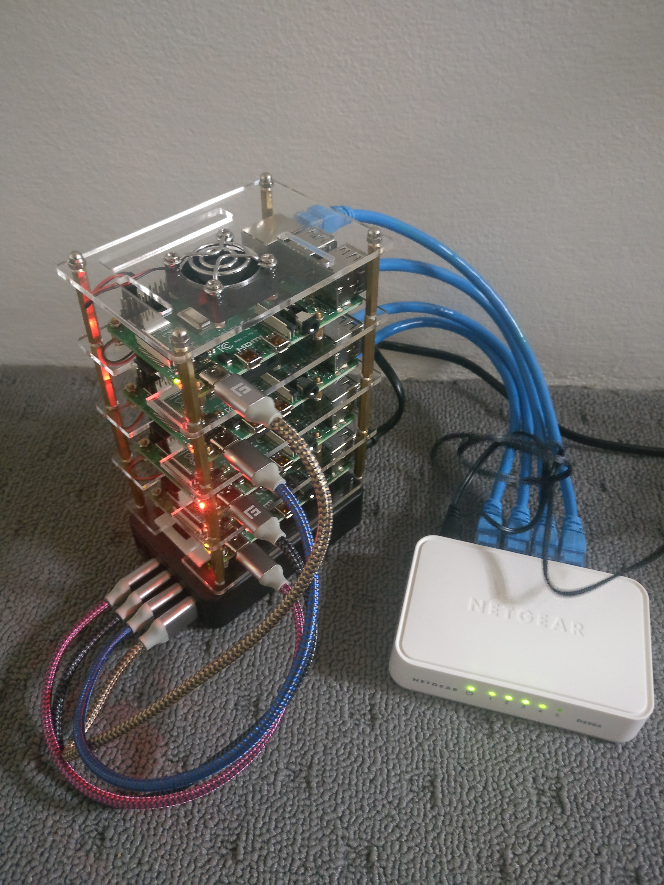

# k3s cluster on raspberry pi with Ansible.

This project is based on these two projects:
- https://blog.alexellis.io/test-drive-k3s-on-raspberry-pi/
- https://github.com/mrlesmithjr/ansible-rpi-k8s-cluster

Their code and explanations are better than mines ;)


## What is k3s? 

[K3s](https://k3s.io/) is a lightweight implementation of kubernetes' API. Small binary easy to install and deploy. That makes it ideal for using it on a Raspberry pi.

### Motivation:

Learning about Ansible, Kubernetes and K3s.

### Hardware:

- 4 x Raspberry Pi 4 Model B with 4GB RAM 
- 4 x Sandisk SDSQUAR-032G-GN6MA Ultra 32GB Micro SD
- 1 x 4-Layer Acrylic Cluster Case With Cooling Fan For Raspberry Pi 4B/3B
- NETGEAR ProSafe 5-Port Gigabit Unmanaged Switch 
- RAVPower 60W 12A 6-Port USB Charger Desktop Charging Station
- Fasgear USB Type C Cable (1ft 5 Pcs) Short USB C to USB A Cable Nylon Braided
- 4 x Ethernet Cable Cat 6 30cm

### Setup:

Configuration k3s cluster:
- 1 master node
- 3 worker nodes

The first node is by far the most critical. We use the first node's wireless connection to provide internet access to the rest of the nodes (a local image cache would be useful) and use it as jump host in ansible.


### Steps

Download Raspbian Buster Lite from [repo](https://www.raspberrypi.org/downloads/raspbian/)

You have to repeat following process with all SD cards.

Insert SD card in your PC and umount it in case it was mounted automatically. (NOTE: mountpoints can be different in your system)
``` bash
umount device
umount /dev/mmcblk0p1
```
Write the image into the SD card:
``` bash
sudo dd bs=4M if=2019-09-26-raspbian-buster-lite.img of=/dev/mmcblk0 status=progress  conv=fsync
536+0 records in
536+0 records out
2248146944 bytes (2.2 GB, 2.1 GiB) copied, 103.182 s, 21.8 MB/s
```
Check the partitions:

``` bash
sudo fdisk -l /dev/mmcblk0
Disk /dev/mmcblk0: 29.74 GiB, 31914983424 bytes, 62333952 sectors
Units: sectors of 1 * 512 = 512 bytes
Sector size (logical/physical): 512 bytes / 512 bytes
I/O size (minimum/optimal): 512 bytes / 512 bytes
Disklabel type: dos
Disk identifier: 0x6c586e13

Device         Boot  Start     End Sectors  Size Id Type
/dev/mmcblk0p1        8192  532479  524288  256M  c W95 FAT32 (LBA)
/dev/mmcblk0p2      532480 4390911 3858432  1.9G 83 Linux
```
We need to mount the SD card as we are provisioning some initial configuration:
``` bash
udisksctl mount -b /dev/mmcblk0p1
Mounted /dev/mmcblk0p1 at /media/kaderno/boot.
udisksctl mount -b /dev/mmcblk0p2
Mounted /dev/mmcblk0p2 at /media/kaderno/rootfs.
```
Enabling SSH, setting up wifi connection and adding my ssh keys:
``` bash
touch /media/kaderno/boot/ssh
sudo  mkdir -m 700 /media/kaderno/rootfs/home/pi/.ssh
sudo cp ~/.ssh/id_rsa.pub /media/kaderno/rootfs/home/pi/.ssh/authorized_keys
sudo chown -R 1000:1000 /media/kaderno/rootfs/home/pi/.ssh/
```
Enable container features:

We need to enable container features in the kernel, edit /boot/cmdline.txt and add the following to the end of the line:

```bash
cgroup_enable=cpuset cgroup_memory=1 cgroup_enable=memory
```

Configuring video memory on /boot/config.txt
```bash
# Set the GPU memory split to 16mb
gpu_mem=16
```

On the master node you also need to set up the Wi-Fi connection:
``` bash
vi /media/kaderno/boot/wpa_supplicant.conf
```
``` bash
wpa_supplicant.conf:
```
``` bash
country=US
ctrl_interface=DIR=/var/run/wpa_supplicant GROUP=netdev
update_config=1

network={
    ssid="your_real_wifi_ssid"
    scan_ssid=1
    psk="your_real_password"
    key_mgmt=WPA-PSK
}
```

Now umount both partitions and repeat until you have all the SDs ready.
``` bash
umount /media/kaderno/boot
umount /media/kaderno/rootfs
```

Once you have all SD cards you can proceed to set up the cluster. Insert the SDs on the Raspberries and let them boot. From your local router you should be able to find out the ip address of the master node. You need to update the file **inventory/hosts.inv** and set the juphost ip address to the ip of your master node. From there, you can apply the ansible playbooks to create the cluster:

Set up master node:

``` bash
ansible-playbook playbooks/master.yml 

```

Updates hostnames and /etc/hosts files and reboot all the nodes:
``` bash
ansible-galaxy install mrlesmithjr.change-hostname
ansible-playbook playbooks/change_hostname.yml

```
Install and configure the k3s cluster:

``` bash
ansible-playbook playbooks/cluster.yml
```

Now you need to configure your kubectl to access this cluster. The configuration is available at **/etc/rancher/k3s/k3s.yaml** in the master node. Add it to your **~/.kube/config** file and don't forget to update the cluster ip address (same as the jumphost). Now you can start using your fresh installed cluster:


``` bash
kubectl get nodes
NAME       STATUS   ROLES    AGE   VERSION
worker-2   Ready    <none>   46h   v1.17.2+k3s1
master     Ready    master   46h   v1.17.2+k3s1
worker-3   Ready    <none>   46h   v1.17.2+k3s1
worker-4   Ready    <none>   46h   v1.17.2+k3s1

```


``` bash
kubectl run --generator=run-pod/v1 nginx --image=nginx-slim-arm
pod/nginx created
kubectl get pods
NAME                     READY   STATUS         RESTARTS   AGE
nginx-85ff79dd56-bqlbr   1/1     Running        1          43h

```


# TO BE CONTINUED...

References:
https://www.raspberrypi.org/documentation/installation/installing-images/linux.md
https://blog.alexellis.io/test-drive-k3s-on-raspberry-pi/
https://github.com/mrlesmithjr/ansible-rpi-k8s-cluster
https://www.raspberrypi.org/documentation/configuration/wireless/headless.md

Ansible:
https://docs.ansible.com/ansible/latest/installation_guide/intro_installation.html
https://www.edureka.co/blog/ansible-tutorial/
https://raspberrypi.stackexchange.com/questions/13137/how-can-i-mount-a-raspberry-pi-linux-distro-image
